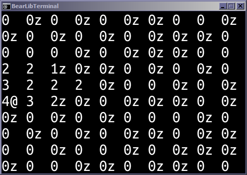

# Corpse Stacker
7DRL 2017 entry. Stack zombie corpses. Don't get eaten.


# How to play

0. Install Python 3 ([python.org](https://www.python.org/downloads/))
0. Clone this repository (or unzip the archive): 
    ```
    git clone https://github.com/serin-delaunay/corpsestacker.git
    ```
0. Enter directory:
    ```
    cd corpsestacker
    ```
0. Install requirements:
    ```
    pip install -r requirements.txt
    ```
0. Play:
    ```
    python corpsestacker.py
    ```
